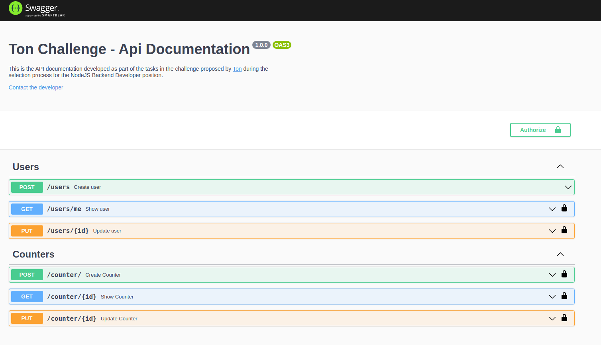

# Ton's Backend Challenge




> Esta é uma API criada para contar os acessos no site da <a href="https://ton.com.br" target="_blank">Ton</a> e faz <br>
> parte de um desafio técnico proposto pela empresa.


## Acesse a Documentação da API

<a href="http://shorturl.at/itvyL" target="_blank"><STRONG>DOCUMENTAÇÃO DA API</STRONG></a>

<br>

## Detalhes do Desafio

Todos os detalhes do desafio estão disponíveis [AQUI](DESAFIO.md), e as principais tarefas são:

- [x] Criar uma rota para incrementar o número de acessos;
- [x] Criar uma rota para consultar o número de acessos;
- [x] Criar uma rota para criar um usuário;
- [x] Criar uma rota para visualizar as informações de um usuário.

<br>

## 💻 Sobre o Projeto

* O projeto foi desenvolvido usando `NODEJS`, `TYPESCRIPT` e `POSTGRES`.
* Na arquitetura, a ideia foi manter as regras de negócio desacoplatas de outras camadas da aplicação <br>
de maneira que pudessem ser portáveis.
* Na camada de Infra, o TYPEORM está configurado como ORM padrão, mas pode ser facilmente subistituido <br>
graças ao baixo acoplamento da camada de Negócios.
* Foram realizados testes unitários para os `Casos de Uso` e teste de integração para os `Controllers`

<br>

## 🚀 Instalando Ton's Backend Challenge

Para instalar o projeto você precisa ter `NODEJS` na versão `14.x` ou superior, `DOCKER` e `DOCKER-COMPOSE` ou `POSTGRES`
instalado na máquina onde o projeto será hospedado.

1 - Clone repositório do projeto:
```
git clone https://github.com/djgoulart/ton-challenge.git
```

2 - Instale as dependências usando  NPM ou YARN:
```
npm install
```
3 - Crie um arquivo `.env` na pasta raíz do projeto ou copie o arquivo `.env.example`, insira um valor para a variável `APP_KEY` que está dentro do arquivo.
```
APP_KEY=<sua_chave_de_criptografia>
```
4 - Configure o arquivo `ormconfig.json` com os dados de acesso ao seu banco de dados. Siga o padrão deixado como exemplo no arquivo `ormconfig.example.json`.

<br>

## Rodando o Projeto em Ambiente de Dev com Docker

Abra um terminal de comando dentro da raiz do projeto e digite o comando abaixo:
```
docker-compose up --build -d
```
O servidor NODE estará rodando em `localhost` na porta `3333`

<br>

## ☕ Criando a estrutura do banco de dados

Rode as migrations para fazer a criação inicial das tabelas.

```
`npm run typeorm migrations:run` ou `yarn typeorm migrations:run`
```

<br>
## ☕ Building para Produção

Para fazer o building use o comando:

```
`npm run build` ou `yarn build`
```
Os arquivos da aplicação serão colocados em uma pasta `dist`
localizada na raiz do projeto.

## ☕ Rodando Testes

Para rodar os testes use o comando:

```
`npm run test` ou `yarn test`
```
Por padrão os testes irão rodar utilizando um banco SQLITE armazenando todos os registros temporáriamente na memória.
`:memory:`
